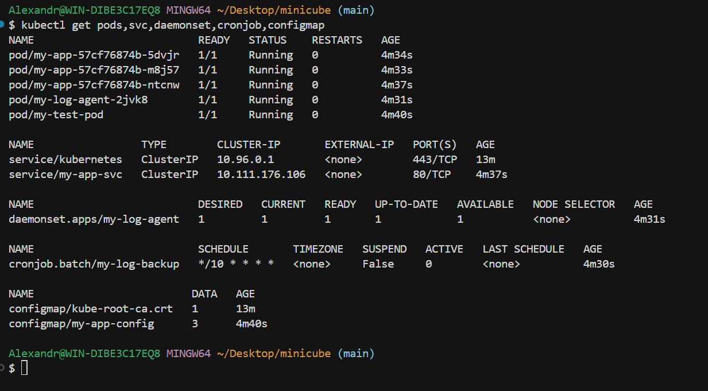
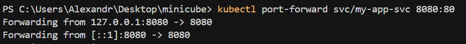
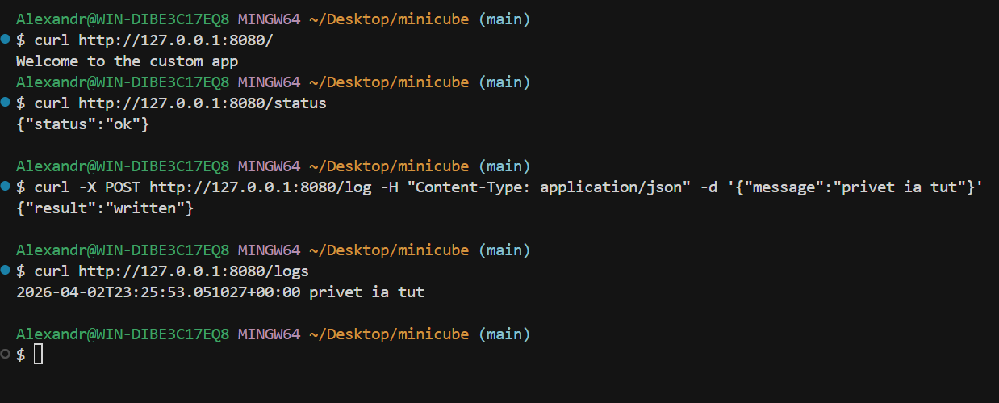
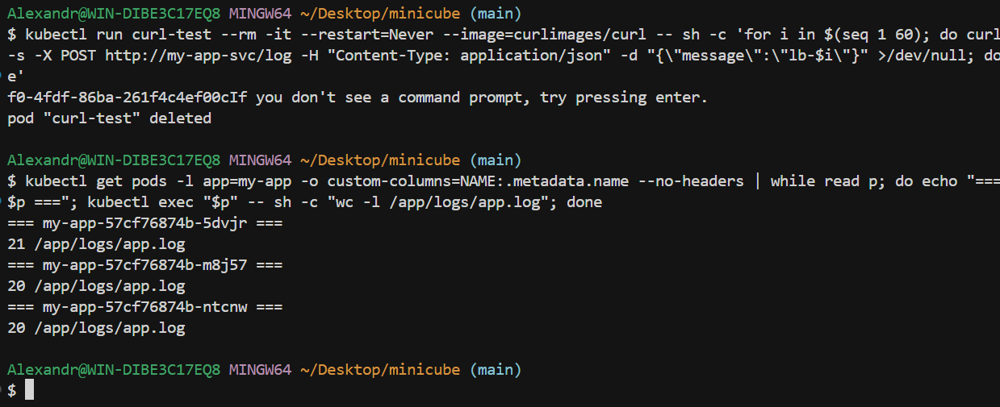
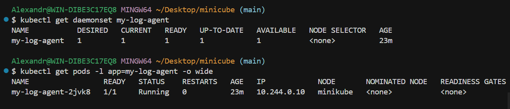
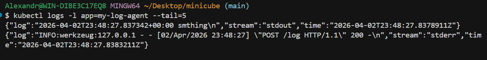
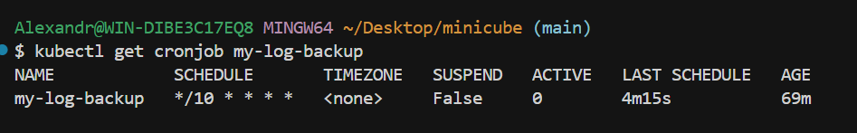
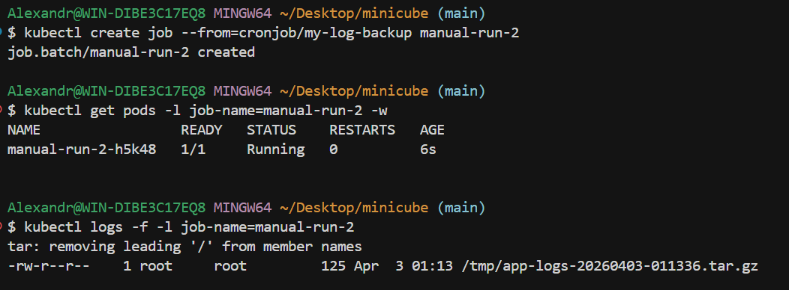
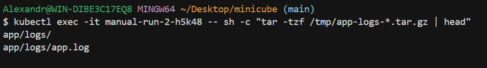

```bash
bash deploy.sh
```

---

### 1.Смотрю состояние кластера



---

### 2. Пробросил порт



---

### 3. Поотрпарлял запросы



---

### 4. Как видно балансировка работает



---

### 5. DaemonSet




---

### 6. Вывел smthing (перед этим записав smthing)




---

### 7. CronJob



---

### 8. Тут я создал Job `manual-run-2` из шаблона CronJob. при этом сделал так чтобы он жил 10 минут после выполнения. Проверил, что он выполнил создание архива и посмотрел его содержимое




