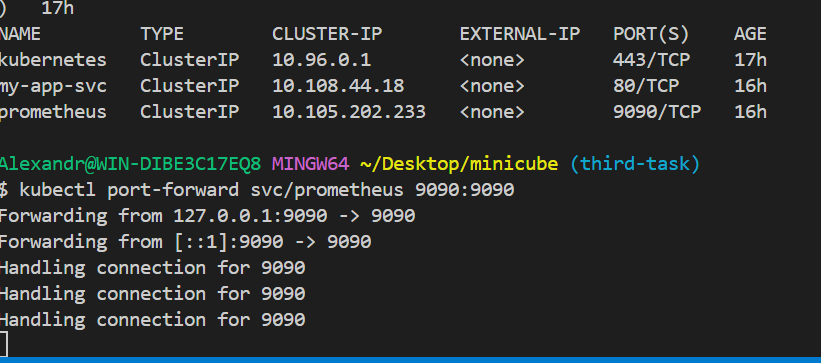
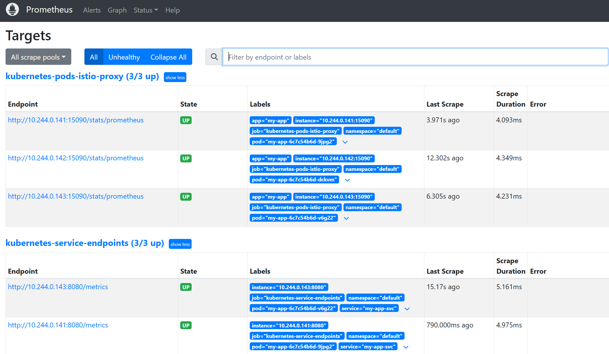
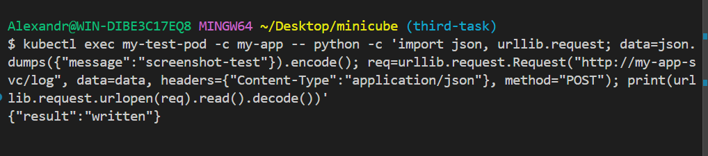
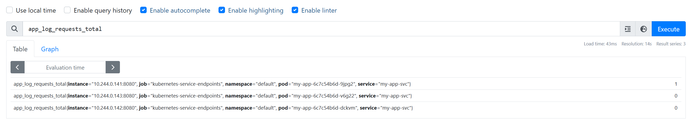
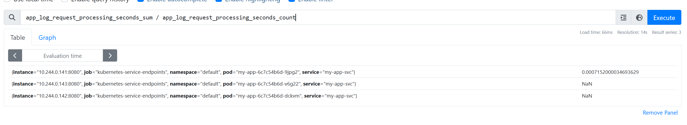

```bash
bash deploy.sh
```

---

### 1. Развернул сервисы и открыл Prometheus



---

### 2. Проверил сбор метрик Prometheus



---

### 3. Проверил работу `/log`



---

### 4. Проверил счетчик вызовов `/log`

В Prometheus доступна метрика `app_log_requests_total`.



---

### 5. Проверил среднее время обработки запроса

Среднее время обработки `/log` `app_log_request_processing_seconds_sum / app_log_request_processing_seconds_count`.


